### Beginner’s web

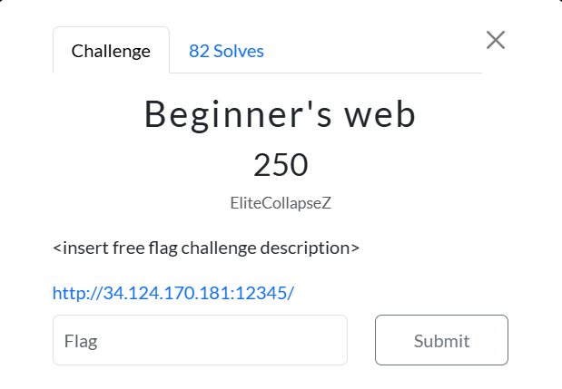

This website is a simple way to learn the beginning of web problems in CTFs. 

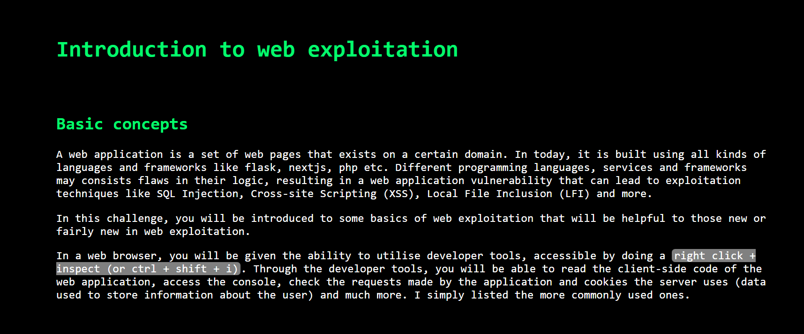

The challenge is split up into 4 easy parts. The 1st part is to find a flag part hidden in the console of the developer tools.

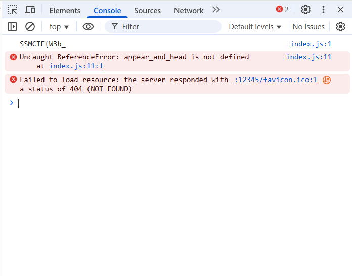

The 2nd part of the flag is shown here:

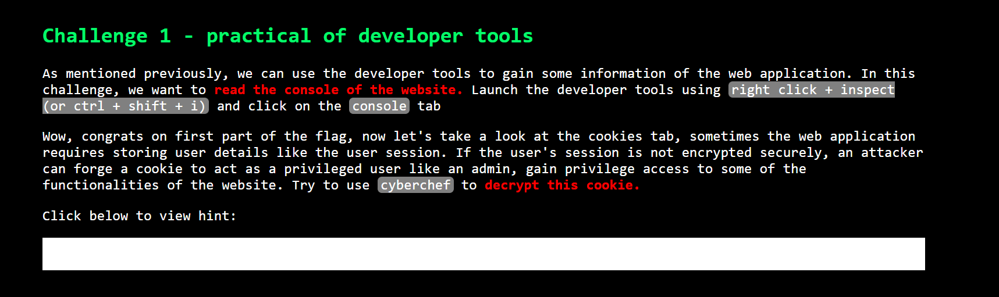

To find the next part of the flag, we need to check the cookies of the page.

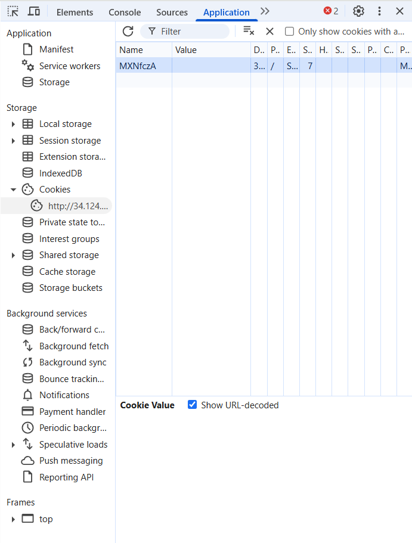

The cookie is stored under the “applications” tab, under the cookies tab. The name of the cookie is “MXNfczA”.

Placing this through Cyberchef ([https://gchq.github.io/CyberChef/](https://gchq.github.io/CyberChef/)), we get this output: 

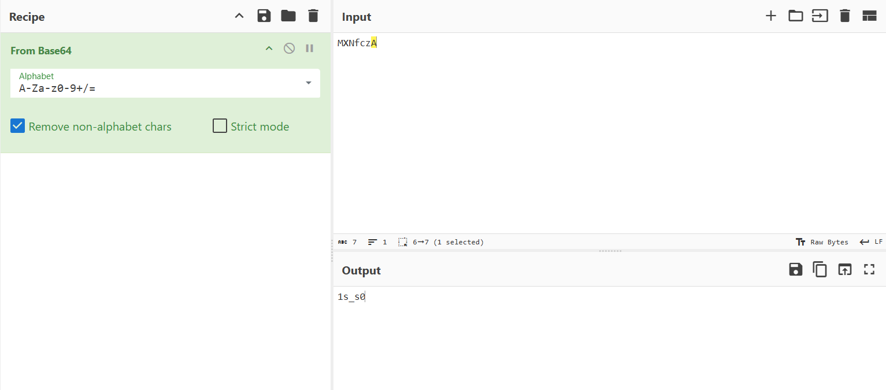

Now, we need to find the 3rd part of the flag.

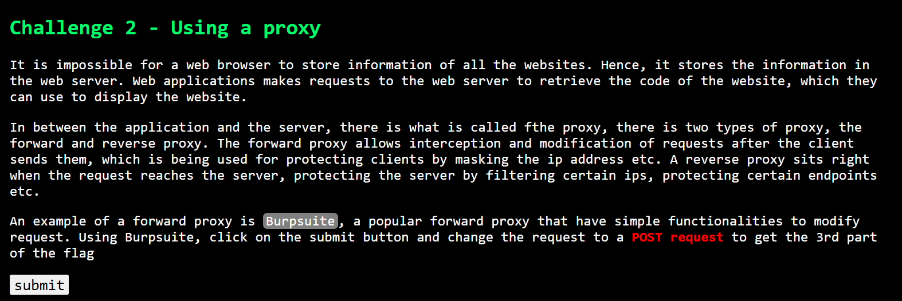

For this task, we need to use Burpsuite ([https://portswigger.net/burp](https://portswigger.net/burp)). We will use this to change the submit request into a POST request. 

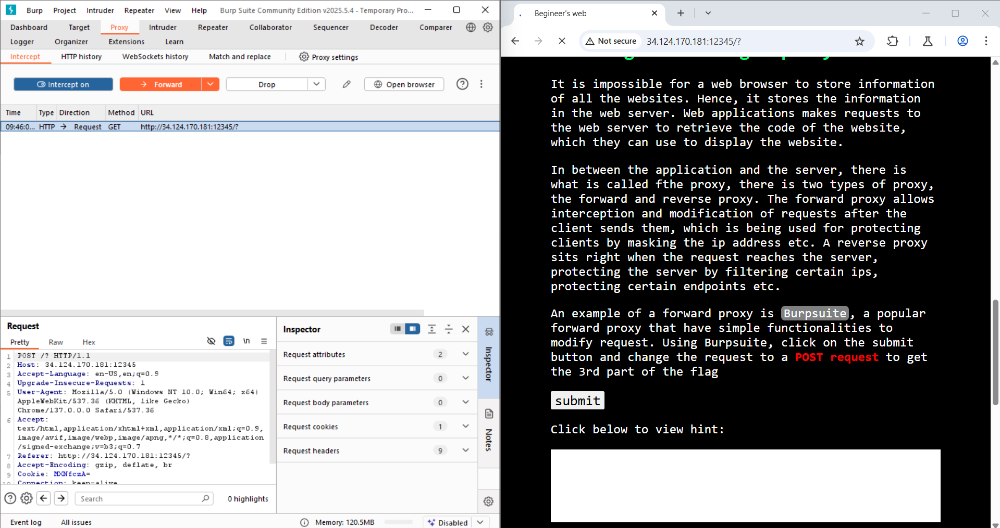

Using Burpsuite, I changed the ‘GET’ request into a ‘POST’ request. This yielded the following output: 

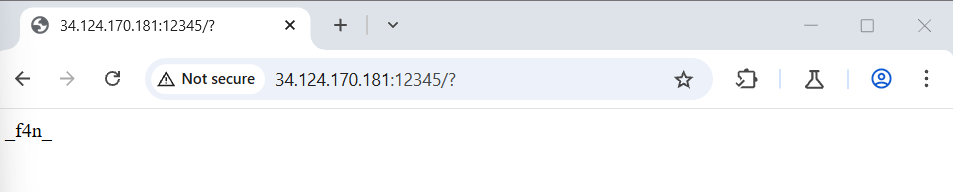

Now, it’s time to find the last part of the flag. 

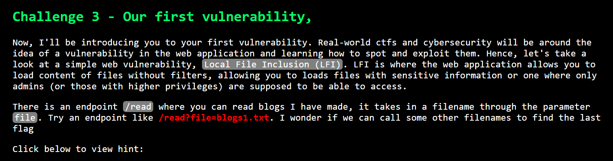

First, we’ll try the stated endpoint, /read?file=blogs1.txt. This yielded this output:

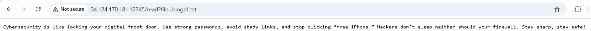
 Instead, let’s try a more common endpoint, which is often flag.txt. 

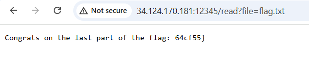

Flag: SSMCTF{W3b_1s_s0_f4n_64cf55}