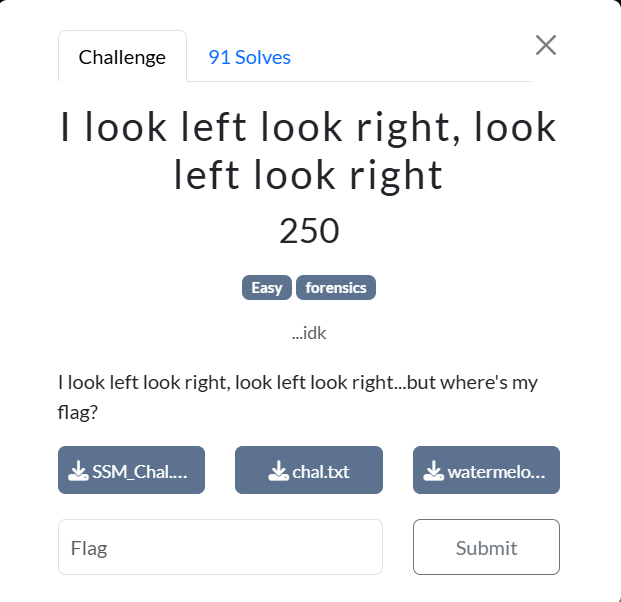
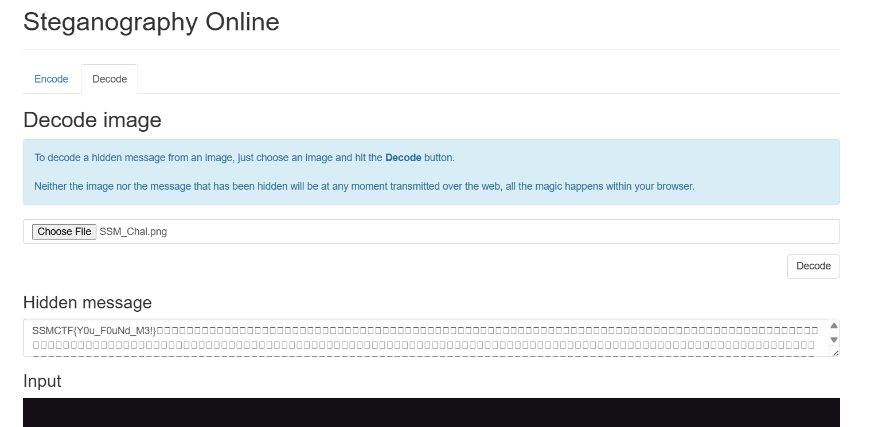

### I look left look right , look left look right

First, we are given an image of the SSM logo to work with.

However, the image appears blurry (the shield does not look right), so it has likely been tampered with, probably via steganography. 

After inserting the image into Steganography Online ([https://stylesuxx.github.io/steganography/](https://stylesuxx.github.io/steganography/)), we get this output:

Flag: SSMCTF{Y0u_F0uNd_M3!}
