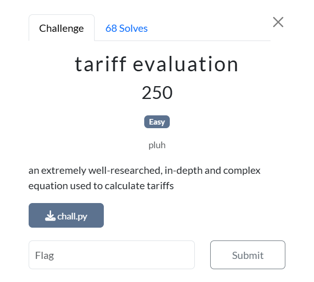
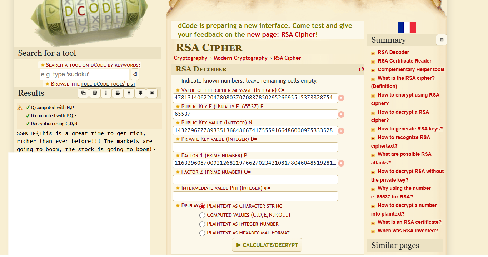

### Tariff evaluation 





The code in chall.py is as follows: 


```python
from sage.all import *
import ast
from hashlib import md5
from base64 import b64decode
from functools import reduce
from numpy import arange
from numpy import log as nplog
from Crypto.Util.number import getPrime, bytes_to_long
from secret import flag

gap.eval('LoadPackage("ctbllib")')
q = PowerSeriesRing(QQ, 'q').gen()

GLOBAL_1 = factorial(10000)
GLOBAL_2 = 0.00001

leak = ((lambda VAR_1: nplog(VAR_1) - VAR_1/(len([VAR_2 for VAR_2 in range(2, VAR_1) if ( lambda VAR_1: all([VAR_1 % VAR_2 for VAR_2 in range(2, VAR_1)]))(VAR_2)])))(GLOBAL_1)) * ((round((1728 * ((4/3) * (1 + 240 * sum([(lambda VAR_1, VAR_2: sum([VAR_3**VAR_1 for VAR_3 in divisors(VAR_2)]))(3, n) * q**n for n in range(1, 5)])))**3 / (((4/3) * (1 + 240 * sum([(lambda VAR_1, VAR_2: sum([VAR_3**VAR_1 for VAR_3 in divisors(VAR_2)]))(3, n) * q**n for n in range(1, 5)])))**3 - 27*((8/27) * (1 - 504 * sum([(lambda VAR_1, VAR_2: sum([VAR_3**VAR_1 for VAR_3 in divisors(VAR_2)]))(5, n) * q**n for n in range(1, 5)])))**2).add_bigoh(5)).add_bigoh(5)[1])-ast.literal_eval(gap.eval('List(Irr(CharacterTable("M")), chi -> Degree(chi));'))[1])) * ((lambda VAR_3: lambda VAR_1: sum([(VAR_1**VAR_2) * (VAR_3[VAR_2 % 4] / (lambda VAR_1: VAR_1 * factorial(VAR_1-1) if VAR_1 else 1)(VAR_2)) for VAR_2 in range(GLOBAL_1)]))([0, 1, 0, -1])(1) ** 2 + (lambda VAR_3: lambda VAR_1: sum([(VAR_1**VAR_2) * (VAR_3[VAR_2 % 4] / (lambda VAR_1: VAR_1 * factorial(VAR_1-1) if VAR_1 else 1)(VAR_2)) for VAR_2 in range(GLOBAL_1)]))([1, 0, -1, 0])(1) ** 2) + (lambda FUNC, VAR_1, VAR_2: sum([GLOBAL_2 * FUNC(VAR_3) for VAR_3 in arange(VAR_1, VAR_2, GLOBAL_2)]))((lambda VAR_3: lambda VAR_1: sum([(VAR_1**VAR_2) * (VAR_3[VAR_2 % 4] / (lambda VAR_1: VAR_1 * factorial(VAR_1-1) if VAR_1 else 1)(VAR_2)) for VAR_2 in range(GLOBAL_1)]))([0, 1, 0, -1]), -0.5, 0.5) * ((lambda VAR_1: int(f'0x{md5(b64decode(VAR_1)).hexdigest()}', 16))("YQAAAAAAAAAAAAAAAAAAAAAAAAAAAAAAAAAAAAAAAAAAAAAAAAAAAAAAAAAAAAAAAAAAAAAAAAAAAAAAAAAAAJtT15kGLJVhHSym6g/aYwYYJMzurOZMzzCafGZ3wpH8EuT1veo0GdLnJUYh7YMYccigMh4+nd0w1GMZhFkwPUSzGK9QghJEhBsQ/TAdrz1zrlB2Oxo4oSLdO/TEWBldns0w3uIrGHN1caStr+JhTaqZWpB9u9DZQpUdmHFcIZnf") / (lambda VAR_1: int(f'0x{md5(b64decode(VAR_1)).hexdigest()}', 16))("YQAAAAAAAAAAAAAAAAAAAAAAAAAAAAAAAAAAAAAAAAAAAAAAAAAAAAAAAAAAAAAAAAAAAAAAAAAAAAAAAAAAAJtT15kGLJVhHSym6g/aYwYYJMxurOZMzzCafGZ3wpH8EuT1veo0GdLnJUYh7QMZccigMh4+nd0w1GMZBFkwPUSzGK9QghJEhBsQ/TAdrz1zrlB2uxo4oSLdO/TEWBldns0w3uIrGHN1caStr+LhTKqZWpB9u9DZQpUdmPFcIZnf")) * ((lambda VAR_1: reduce(lambda VAR_2, _: 1 + 1 / VAR_2, range(VAR_1 - 1), 1))(GLOBAL_1) ** 2 - (lambda VAR_1: reduce(lambda VAR_2, _: 1 + 1 / VAR_2, range(VAR_1 - 1), 1))(GLOBAL_1))


pt = bytes_to_long(flag.encode('utf-8'))
p, q = getPrime(1024), getPrime(1024)
n = p * q
ct = pow(pt, 0x10001, n)

print(f'{ct = }')
print(f'{n = }')
print(f'{p - leak = }')

#ct = 4781314062204780803707083785029526695515373328754437058360148481983776761238818824513873915894272458596935350980408035233897241944785362251336400778024643919001797904298257118956520404524323559715746000068412954302542636386259106528078043580652880881897576074268512303671155030218729500291454403743708608548480977506269831895151273739405520980230118053504663654907891856282911532618045404860638219785802714538998317878998629883714243141387091669847359587414088871667047728752324989888015074594967676359710063823610770145417994477795587582507026793311537537265129227699483332016257848146975506362526106699486237406763
#n = 14327967778933513684866741755591664860009753335289842801500138776246927388908565045549036953515821363782360195603223134969430251873746384902650245859216942478227679940968216392374020987088032189979649651207466678612481243028925015679241748401963491207527485705180215317627141927757414725735045204253853660905080780363956413549452746600539875673613497721615180116534516152310881448965832037145076142117113964080856096271518220684895761507535874424951586089881169141701209499788164074440619615229101530812012074536366473358651533916950773961659249817974974369435476243005102815457927657745687933477253799476265131761443
#p - leak = 116329608700921268219766270234310817804604851928199730711558466567902777993123659585400002712294671354175439631889219638125564836115230152964446576187727220004877191154015250469077590936104201390817315774241347283869619414516623651771211649835826869325694760344337757904706438096211760033894962243458863212410
```


The code here is an implementation of RSA, except that there is a leak in the value of p. However, the leak is hidden behind a very, very long line of code, and seems to be very difficult to find. So, it is reasonable to assume the leak is a very small number, perhaps 0 or 1. Since p-leak is an even number, one can make the assumption that leak =1, such that p becomes prime. After inputting these edited values into an online RSA decoder ([https://www.dcode.fr/rsa-cipher](https://www.dcode.fr/rsa-cipher)), we obtain the flag.





(note: 0x10001 equates to 65537)

Flag: SSMCTF{This is a great time to get rich, richer than ever before!!! The markets are going to boom, the stock is going to boom!}