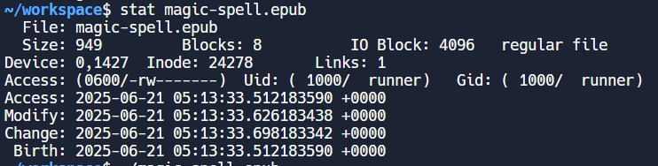
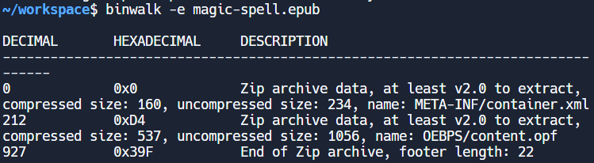
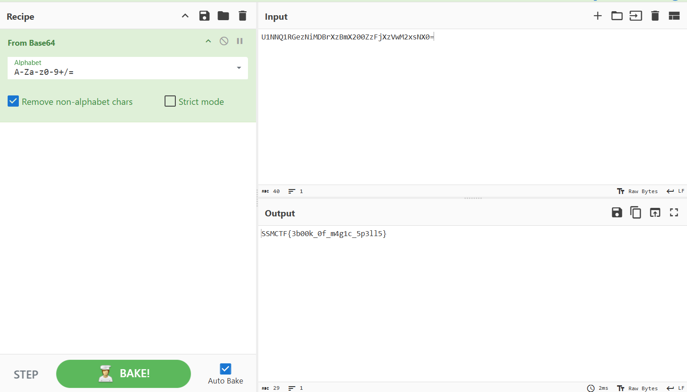

### Magic Spell


After downloading the file, I went to check its metadata.





Next, I ran the file through binwalk to see if there were hidden files inside. 





Ok, now we’re getting somewhere. Next, I opened up the extracted files, and found this:


```xml
<?xml version="1.0" encoding="UTF-8"?>
<package xmlns="http://www.idpf.org/2007/opf" version="3.0" xml:lang="en">
  <metadata xmlns:dc="http://purl.org/dc/elements/1.1/" xmlns:opf="http://www.idpf.org/2007/opf">
    <dc:title>Shadowy Ebook</dc:title>
    <dc:creator opf:role="aut">Digital Phantom</dc:creator>
    <dc:publisher>Underground Publishing Collective</dc:publisher>
    <dc:date opf:event="publication">2024-11-15</dc:date>
    <dc:identifier opf:scheme="ISBN">978-1234567890</dc:identifier>
    <dc:identifier opf:scheme="UUID">U1NNQ1RGezNiMDBrXzBmX200ZzFjXzVwM2xsNX0=</dc:identifier>
    <dc:rights>Distributed under a clandestine license</dc:rights>
    <opf:meta property="dcterms:modified">2025-05-14T15:26:00Z</opf:meta>
    <opf:meta property="dcterms:created">2024-11-10T10:00:00Z</opf:meta>
    <opf:meta property="generator">eBookForge v1.0</opf:meta>
  </metadata>
  <manifest>
    <item id="content" href="content.opf" media-type="application/oebps-package+xml"/>
    </manifest>
  <spine>
    </spine>
</package>
```


There’s some suspicious text here, under the UUID. Passing it through Cyberchef ([https://gchq.github.io/CyberChef/](https://gchq.github.io/CyberChef/)), we obtain this output:





(flag passed through a base64 decryption)

Flag: SSMCTF{3b00k_0f_m4g1c_5p3ll5}
