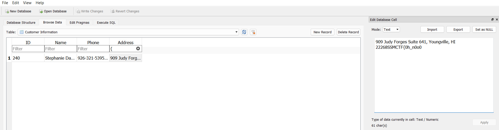
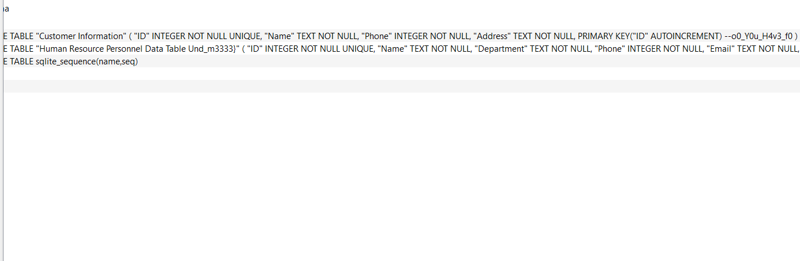

### Peekaboo

In this challenge, we were given a database file, and had to find flag components hidden in them. 

To find the 1st part of the flag, I systematically searched “{“ in the database, eventually finding it in one of the data entries. 

The next two parts were found in the create table statements of the database. Combining it all together, we found the flag. 

Flag: SSMCTF{0h_n0o0_Y0u_H4v3_f0Und_m3333}
