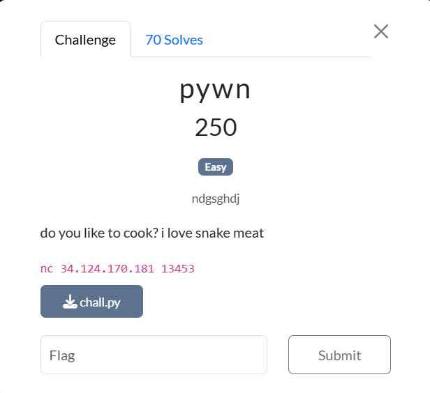

### Pywn





The chall.py code is shown below: 


```python
#!/usr/bin/python3
import os

binned_head = None
recipes = [None] * 16

system = os.system


def delete_handler(name):
    print(f"DELETING: {name}")

class RecipeNode:
    def __init__(self, name, recipe):
        self.name = name
        self.recipe = recipe
        self.next = None

def create_recipe():
    try:
        idx = int(input("What page (0-15) of your cookbook do you want to write your recipe in? "))
        assert 0 <= idx <= 15
    except:
        print("That's not a valid page!")
        return
    name = input("What will you call this recipe? ")
    recipe = input("Describe this recipe: ")
    recipes[idx] = RecipeNode(name, recipe)
    print("Added your recipe!")

def edit_recipe():
    try:
        idx = int(input("What page (0-15) of your cookbook do you want to edit? "))
        assert 0 <= idx <= 15
    except:
        print("That's not a valid page!")
        return

    r = recipes[idx]
    if r is None:
        print("That's not a recipe yet!")
        return
    r.name = input("What will you call this recipe now? ")
    r.recipe = input("Describe this recipe: ")
    print("Edited your recipe!")


def bin_recipe():
    global binned_head
    try:
        idx = int(input("What page (0-15) of your cookbook do you want to bin? "))
        assert 0 <= idx <= 15
    except:
        print("That's not a valid page!")
        return
   
    r = recipes[idx]

    if r is None:
        print("That's not a recipe yet!")
        return

    r.recipe = hex(id(delete_handler))
    if binned_head is None:
        binned_head = r
        binned_head.next = None
    else:
        r.next = binned_head
        binned_head = r

    print("Binned recipe!")

def clear_bin():
    global binned_head
    while binned_head is not None:
        d_handler = [x for x in globals().values() if id(x) == int(binned_head.recipe, 16)][0]
        d_handler(binned_head.name)
        binned_head = binned_head.next

def menu():
    print("======= Master Cookbook =======")
    print("1. create a recipe")
    print("2. edit a recipe")
    print("3. bin a recipe")
    print("4. clear your bin")
    print("5. exit")

def main():
    print(f"system: {hex(id(system))}")
    while True:
        menu()        
        choice = int(input(">> "))

        match choice:
            case 1:
               create_recipe()
            case 2:
               edit_recipe()
            case 3:
                bin_recipe()
            case 4:
                clear_bin()
            case 5:
                break
            case _:
                print("Invalid choice")

main()
```


Essentially, this code has a bug in the clear bin function, where it can be hijacked in order to redirect the function address to any function the user wants. In this case, we will use this to create a shell in the system. 

The steps of solving are as follows (as of the time of writing, the netcat service has stopped working, hence no flag is provided):


1. Connect to the server via netcat. On connection, the system address is outputted.
2. Create a recipe on any page, naming it /bin/sh. The details can be anything.
3. Bin the recipe.
4. Edit the recipe again, keeping the same title, but changing the details to the earlier system address in step 1.
5. Clear the bin, which yields a shell now.
6. Using the shell, run ls, showing a file called flag.txt
7. Run cat flag.txt to find the flag.