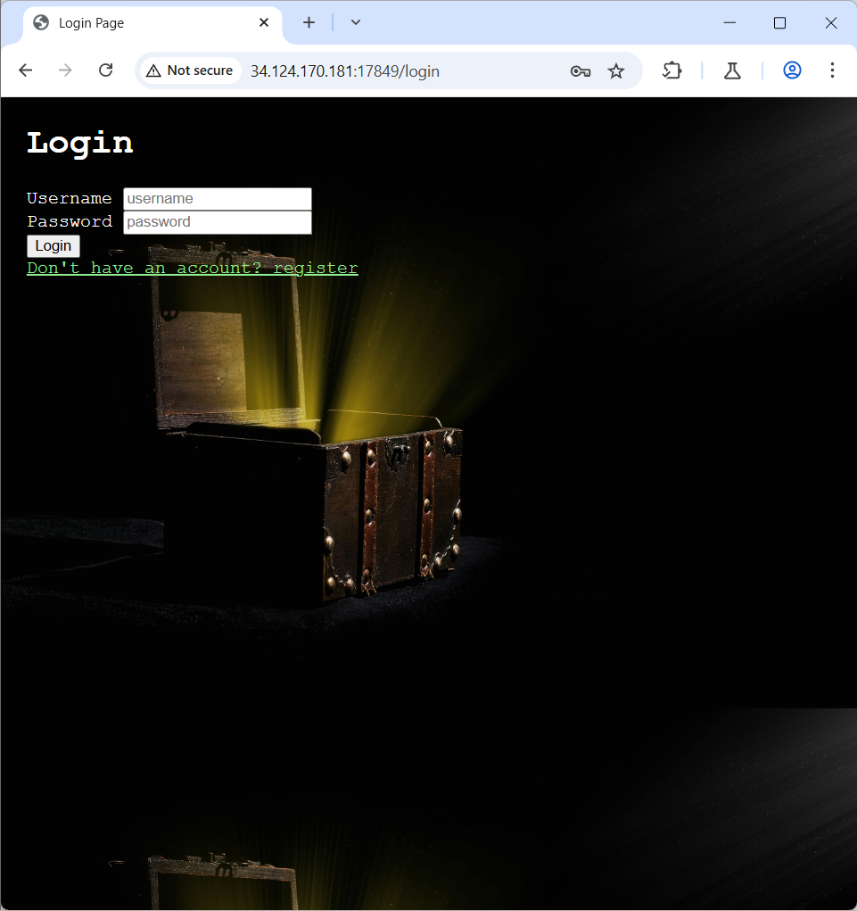

### Stealing treasure 


Essentially, this challenge is about an admin escalation exploit, where the task is to somehow gain the admin status. The python code used to create the flag is shown below:


```python
from flask import Flask, render_template, request, redirect, make_response, jsonify, flash
import sqlite3
from sqlite3 import Error
import hashlib
import jwt
import datetime
from dotenv import load_dotenv
import os

app = Flask(__name__)

load_dotenv()
app.config['SECRET_KEY'] = os.getenv('SECRET_KEY')

def auth():
    token = request.cookies.get('token')
    if token:
        try:
            decoded_token = jwt.decode(token, app.config['SECRET_KEY'], algorithms=['HS256'])
            id, admin = decoded_token['id'], decoded_token['admin']
            return id, admin
        except:
            return -1, 0
           
    else:
        redirect('/login')
        return -1, 0

@app.route('/')
@app.route('/index')
def index():
    cookies = request.cookies.get('token')
    if cookies:
        return redirect('/treasure')
    else:
        return render_template('index.html')
       
@app.route('/treasure')
def treasure():
    id, admin = auth()
    if id == -1:
        return redirect('/login')
    conn = sqlite3.connect('treasure.db')
    sql = 'SELECT treasure FROM treasure WHERE username = (SELECT username FROM users WHERE id = ?)'
    cur = conn.execute(sql, (id,))
    results = [item[0] for item in cur.fetchall()]
    conn.close()
       
    return render_template('treasure.html', treasure = results, admin = admin)

@app.route('/login', methods = ['GET', 'POST'])
def login():
    if request.method == 'GET':
        id, _ = auth()
        if id != -1:
            return redirect('/treasure')
        else:
            return render_template('login.html')
       
    elif request.method == 'POST':
        id, admin = auth()
        if id != -1:
            return redirect('/treasure')
       
        username = request.form.get('username')
        password = request.form.get('password')
        conn = sqlite3.connect('treasure.db')
        sql = 'SELECT * FROM users WHERE username = ? AND password = ?'
        try:
            results = conn.execute(sql, (username, password)).fetchall()
            conn.close()
            if len(results) > 0:
                results = results[0]
                id, username, password, admin = results[0], results[1], results[2], results[3]

                payload = {
                    'id': id,
                    'admin': admin,
                    'exp': datetime.datetime.utcnow() + datetime.timedelta(hours=1)
                }
                token = jwt.encode(payload, app.config['SECRET_KEY'], algorithm='HS256')
               
                response = make_response(redirect('/treasure'))
                response.set_cookie('token', token, max_age=60*60*5)
                return response
            redirect('/login')
            return render_template('login.html', alert_message = 'Incorrect username or password')
        except Error as e:
            redirect('/login')
            return render_template('login.html', alert_message = 'Incorrect username or password')

@app.route('/register', methods = ['GET', 'POST'])
def register():
    if request.method == 'GET':
        id, _ = auth()
        if id != -1:
            return redirect('/treasure')
        return render_template('register.html')
   
    elif request.method == 'POST':
        id, _ = auth()
    if id != -1:
        return redirect('/treasure')
   
    username = request.form.get('username')
    password = request.form.get('password')

    if len(password) < 8:
        return render_template('register.html', alert_message = 'password to have a length of 8 or more')
    if not any(char in password for char in '!@#$%^&*()'):
        return render_template('register.html', alert_message = 'you need to have at least one symbol in your password')
   
    conn = sqlite3.connect('treasure.db')
    cursor = conn.cursor()
    sql = 'INSERT INTO users (username, password, admin) VALUES (?, ?, ?)'
    sql_insert = 'INSERT INTO treasure (username, treasure) VALUES (?, ?)'
   
    try:
        cursor.execute(sql, (username, password, 0))
        id = cursor.lastrowid
        conn.commit()

        #default treasures :D
        conn.execute(sql_insert, (username, 'diamond sword'))
        conn.execute(sql_insert, (username, 'ruby'))
        conn.execute(sql_insert, (username, 'sapphire'))
        conn.commit()

        #create token
        payload = {
                'id': id,
                'admin': 0,
                'exp': datetime.datetime.utcnow() + datetime.timedelta(hours=1)
            }
        token = jwt.encode(payload, app.config['SECRET_KEY'], algorithm='HS256')
       
        response = make_response(redirect('/treasure'))
        response.set_cookie('token', token, max_age=60*60*5)
        conn.close()
        return response
    except Error as e:
        alert_message = e
        redirect('/register')
        conn.close()
        return render_template('register.html', alert_message = alert_message)
   

@app.route('/steal')
def steal():
    id, admin = auth()
    if admin:
        try:
            conn = sqlite3.connect('treasure.db')
           
            sql = 'SELECT username FROM users WHERE id = ?'
            username = conn.execute(sql, (id,)).fetchall()[0][0]
           
            sql = '''UPDATE treasure
            SET treasure = (
                SELECT treasure FROM treasure WHERE username = 'admin' LIMIT 1
            )
            WHERE username = ?'''
            conn.execute(sql, (username,))
            conn.commit()
            conn.close()
        except Error as e:
            pass

       
        return jsonify({'steal': 'true', 'message': 'You have stolen some treasure :0'})
    else:
        return jsonify({'steal': 'false', 'message': 'You need to be admin to steal!'})

@app.route('/password', methods = ['GET', 'POST'])
def password():
    if request.method == 'GET':
        return render_template('password.html')
   
    elif request.method == 'POST':
        id, admin = auth()
       
        update = []
        for details in request.form:
            update.append([details, request.form.get(details)])

        try:
            for change in update:
                conn = sqlite3.connect('treasure.db')
                sql = 'PRAGMA table_info(users)'
                results = conn.execute(sql).fetchall()
                results = [column[1] for column in results]

                if change[0] in results:
                    if change[0] == 'password':
                        if len(change[1]) < 8:
                            return render_template('password.html', alert_message = 'password to have a length of 8 or more')
                        if not any(char in change[1] for char in '!@#$%^&*()'):
                            return render_template('password.html', alert_message = 'you need to have at least one symbol in your password')
                    sql = f'UPDATE users SET {change[0]} = ? WHERE id = ?'
                    conn.execute(sql, (change[1], id))
                    conn.commit()
               
            conn.close()
            return jsonify({'status': 'success'})
        except Error as e:
            return jsonify({'status': 'fail'})

@app.route('/logout')
def logout():
    response = make_response(redirect('/login'))
    response.set_cookie('token', '', expires=0)
    return response


if __name__ == '__main__':
    app.run(host='0.0.0.0', port=5000, debug=False)
```


Essentially here, we aim to get admin status from the password endpoint, which allows us to gain admin rights. Let’s start by accessing the web page itself. 


First, let’s try to login to the page. Since I haven’t registered yet, I will create a new account via registering for one. 





At the registering page, I created an account, using the credentials of “Tester1234” for the username, and [REDACTED] for the password (the password can be anything, as long as the webpage accepts it). 


Upon registering, the following “treasure” is found at /treasure. However, none of these are the flag we want to find. 


The next step I tried was to ‘steal’ the treasure, but this did not work, as I lacked admin capabilities. So, I tried to do so via the password change page, and clicked on “change password”. This brought me to the following page:


After inputting my new password (in this case I used Testing1234!), I intercepted the request using Burpsuite. 


Pay attention to line 16 of the Burpsuite request. In plaintext, it contained a string to set the password to the new password I had set just now. To this, I added “&admin=1” to the same line, and submitted the request to the web server. 


This left me with a simple screen showing the following output:


Following this, I logged out of the account, which would refresh the web server, and give me admin access. After logging back in, and stealing the treasure, I was greeted with the following output:


Returning to the /treasure endpoint and refreshing the page, I was greeted with the following output: 


And thus, the flag was found.

Flag: SSMCTF{Br0ken_acc33ss_c0ntr0l_succ44ssful_aad01750ee1b}