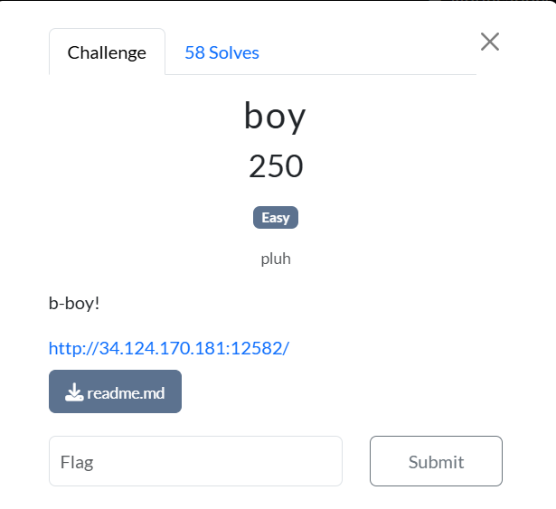

### boy





This challenge involved an SQL injection into a website running on flask. When we open the website, we see this: 


Looking at the source code of the webpage, we find this inside the comments: 


```python
from string import printable
from flask import Flask, request, render_template, send_file, redirect, url_for, flash
import sqlite3
import os
from secret import flag

def init_db():
    with sqlite3.connect('boy.db') as conn:
        conn.execute('''CREATE TABLE IF NOT EXISTS duh (
                        id INTEGER PRIMARY KEY AUTOINCREMENT,
                        boy TEXT,
                        duhhh TEXT)''')

        conn.execute('''CREATE TABLE IF NOT EXISTS flag (
                        flagtext TEXT)''')
        
        duh = [("duh", "duh!"), ("yeah", "yeah!"), ("lol", "lol!")]
        conn.executemany('''INSERT INTO duh (boy, duhhh) VALUES (?, ?)''', duh)
        conn.execute('''INSERT INTO flag (flagtext) VALUES (?)''', (flag,))

init_db()
def search(boy):
    try: 
        with sqlite3.connect('boy.db') as conn:
            # does this work? duh it does...
            blacklist = (char for char in printable if char not in "ABCDEFGHIJKLMNOPQRSTUVWXYZabcdefghijklmnoprqstuvwxyz")

            if 'flag' in boy: return "nope!"
            
            filtered_term = ''
            for char in boy:
                if char not in blacklist:
                    filtered_term += char

            cursor = conn.cursor()
            query = f"SELECT duhhh FROM duh WHERE boy = '{filtered_term}'"
            cursor.execute(query)
            result = cursor.fetchone()

            if result is None: result = "duh :/" 
            else: 
                result = result[0]
                if "SSMCTF" in result: return "nope!"
        
            return result
    except Exception as e:
        return str(e)

app = Flask(__name__)
app.config['SECRET_KEY'] = os.urandom(64)

@app.route('/', methods=['GET', 'POST'])
def index():
    if request.method == 'POST':
        duh = request.form['duh']
        return render_template('base.html', duh=search(duh))
    return render_template('base.html', duh='duh')

if __name__ == "__main__":
    app.run(host='0.0.0.0', debug=True)
```


Essentially, there is an SQL database hidden in the web server. The SQL database contains 2 tables, ‘duh’ and ‘flag’. Naturally, the table ‘flag’ contains the real flag, while ‘duh’ contains only standard data. When submitting an input to the server via the “find a boy” text box, the function “search” is called. From the look of this, this is likely vulnerable to SQL injection. 


```python
query = f"SELECT duhhh FROM duh WHERE boy = '{filtered_term}'"
```


The above line of code is where the vulnerability lies. Because of the way the format string is set up, bad inputs can be present to extract data from the ‘flag’ table instead. 

However, there are safeguards in place that attempt to block out the successful SQL injection of the flag, attempting to clean the input, or to prevent the output. On the side of cleaning / sanitising the input, the following lines of code aim to do so:


```python
            blacklist = (char for char in printable if char not in "ABCDEFGHIJKLMNOPQRSTUVWXYZabcdefghijklmnoprqstuvwxyz")

            if 'flag' in boy: return "nope!"
            
            filtered_term = ''
            for char in boy:
                if char not in blacklist:
                    filtered_term += char
```


In this case, a blacklist has been defined to sanitise the input. However, the line of code that defines blacklist, creates blacklist as a generator, which is discarded from memory after being used once. This means that after the 1st input, ‘blacklist’ becomes ‘none’, which means all characters will now be appended to the filtered term. 

The next obstacle is that there is a line of code preventing the exact text ‘flag’ from appearing in the input. This line is easier to break, since SQL is case-insensitive, allowing inputs such as ‘FlAg’ to be read the same as ‘flag’. So, as long as the exact term ‘flag’ does not appear in the input, all will be fine. 


```python
                result = result[0]
                if "SSMCTF" in result: return "nope!"
```


The final roadblock is in the output processing. The term “SSMCTF” cannot appear at all in the output, or it will be rejected. Since the flag format starts with “SSMCTF”, this could be a problem. Luckily, SQL contains a “substr()” function that allows part of the string to be extracted into the result, bypassing this output processing. 

In short, there are 3 criteria to hit for the flag to be retrieved:


1. Craft the injection with the 1st letter being in the blacklist, so all other characters will be accepted (the 1st letter does not matter, and can be assigned to an arbitrary character like ‘a’).
2. The exact word ‘flag’ cannot appear in the injection input
3. Use the SQL ‘substr()’ function to grab a segment of the flag without the ‘SSMCTF’ in the result.

To get the flag, we will be using the “UNION SELECT” keyword in SQL, which will help us gain access to the flag in its table. The crafted injection that I used was " a' UNION SELECT substr(FlAgtext,2) FrOm FlAg -- "


Submitting this input, we are able to extract the flag (with the leading S omitted)! 

Flag: SSMCTF{b-b-bb-b-oy:::;bob-b-oy;;duh!duh!duh!duh!}

